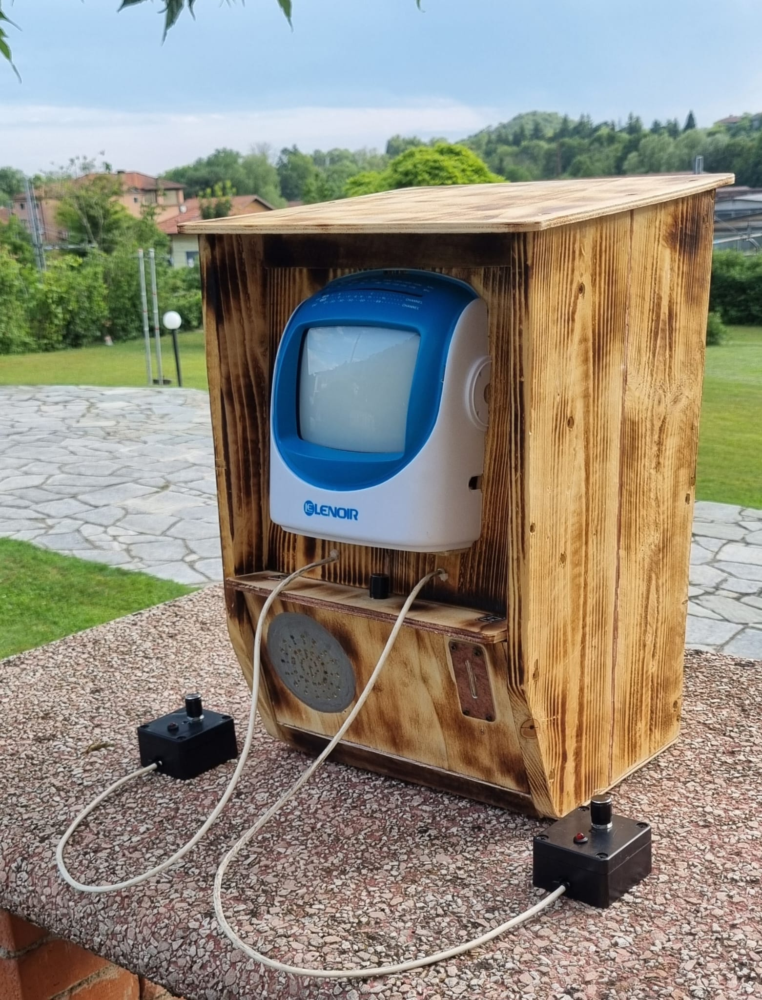
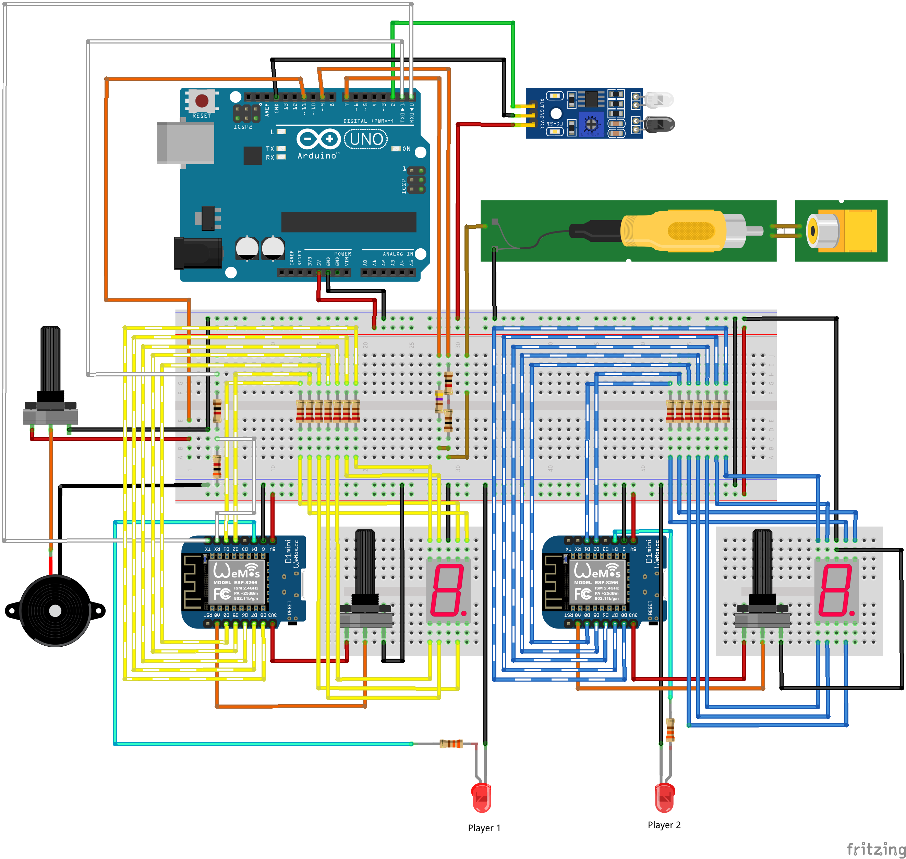

# PONG Arcade

## Indice
- [Descrizione del Progetto](#descrizione-del-progetto)
- [Architettura del Sistema](#architettura-del-sistema)
- [Schema di Collegamento](#schema-di-collegamento)
- [Componenti Hardware](#componenti-hardware)

## Descrizione del Progetto
PONG Arcade è un cabinato retrò dedicato al videogioco omonimo, costruito utilizzando una piccola TV a tubo catodico. Il progetto è basato sull'utilizzo di un Arduino UNO come modulo centrale (logica applicativa del gioco e trasmissione del segnale video) e sull'utilizzo di due controller ESP8266 separati. Questi ultimi elaborano l'input dato dai giocatori tramite due potenziometri lineari e sfruttano display a 7 segmenti e LED per la gestione e visualizzazione del punteggio. 

## Architettura del Sistema
Il sistema si basa su un'architettura distribuita composta da tre board che comunicano tra loro:
1. **Master (Arduino Uno):** Gestione del gioco, della fisica della pallina, della generazione del segnale video e del sensore IR per la gettoneria 
2. **Controller 1 e 2 (Wemos D1 Mini - ESP8266):** Microcontrollori che si occupano di leggere gli input analogici, aggiornare i display a 7 segmenti dei punteggi e gestire i LED

**Comunicazione:** Il Master comunica con il primo controller tramite Seriale (UART), mentre i due controller si scambiano i dati di sincronizzazione in wireless attraverso il protocollo **ESP-NOW**.

**Librerie**
* [`TVout.h`](https://docs.arduino.cc/libraries/tvout/): Generazione del segnale video analogico
* `espnow.h`: Comunicazione wireless a bassa latenza
* `ESP8266WiFi.h`: Libreria Wi-Fi

**Alimentazione**

Il sistema è alimentato a 12V per soddisfare i requisiti della TV CRT. Tuttavia, viene utilizzato un modulo Step-Down DC-DC tarato a 5V per l'alimentazione dell'Arduino Uno (e conseguentemente delle due ESP8266) mediante porta USB.

## Schema di Collegamento
_Nota: Lo schema seguente utilizza un sensore infrarossi FC-51 e non quello utilizzato specificatamente nel progetto_

## Componenti Hardware
- 1 x Arduino Uno R3
- 2 x Wemos D1 Mini (ESP8266)
- 1 x TV a tubo catodico (CRT) con ingresso RCA composito
- 1 x Sensore IR FC-03
- 3 x Potenziometri lineari (2 x 250kΩ, 1 x 10kΩ)
- 2 x Display a 7 segmenti
- 1 x Modulo Step-Down DC-DC (da 12V a 5V)
- 1 x Speaker 1W 8Ω
- Componenti passivi (resistenze da 100Ω / 220Ω / 330Ω / 470Ω / 1000Ω)

